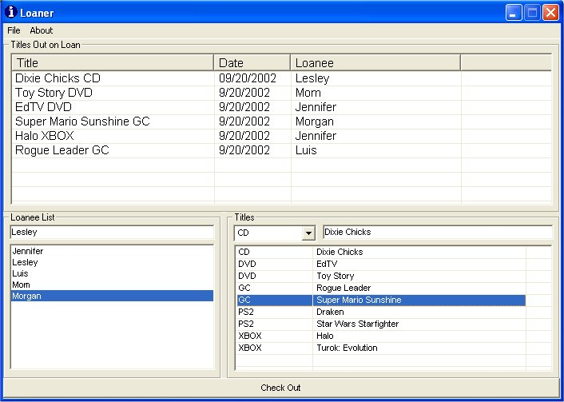



## Loaner

### Description

If you're like me, and loan out DVD's, Video Games, etc and can't keep track of who they go to, this may help you out. Writes everything to MS Access Database using DAO 3.6, creates a database if it doesn't already exist. Functions include adding to and deleting entries, sorting, text selection within' textboxes, and more. I did this up in one evening, hopefully this helps you in your own applications.  

Instructions:

Entering Loaners, type in their name and hit enter to Save, Double Click the ListBox to delete them. Same goes with entering Titles.

To check out a title to a Loaner, select the Loaner, select the Title, and click Check Out. They get added to the LoanList Table along with the Date they checked it out. This can be totally customized to fit your needs, this is my first submission to Planet-Source-Code in my 2+ years of VB6.   

Note:

If you find this code or program useful, please give credit in your compiled program's About Box, Documentation, Wherever.

Please vote!
 
### More Info
 

             |
---                |---
**Submitted On**   |2002-09-20 22:24:18
**By**             |[IanCT](https://github.com/Planet-Source-Code/PSCIndex/blob/master/ByAuthor/ianct.md)
**Level**          |Advanced
**User Rating**    |4.9 (39 globes from 8 users)
**Compatibility**  |VB 6\.0
**Category**       |[Complete Applications](https://github.com/Planet-Source-Code/PSCIndex/blob/master/ByCategory/complete-applications__1-27.md)
**World**          |[Visual Basic](https://github.com/Planet-Source-Code/PSCIndex/blob/master/ByWorld/visual-basic.md)
**Archive File**   |[Loaner1340359212002\.zip](https://github.com/Planet-Source-Code/ianct-loaner__1-39155/archive/master.zip)

